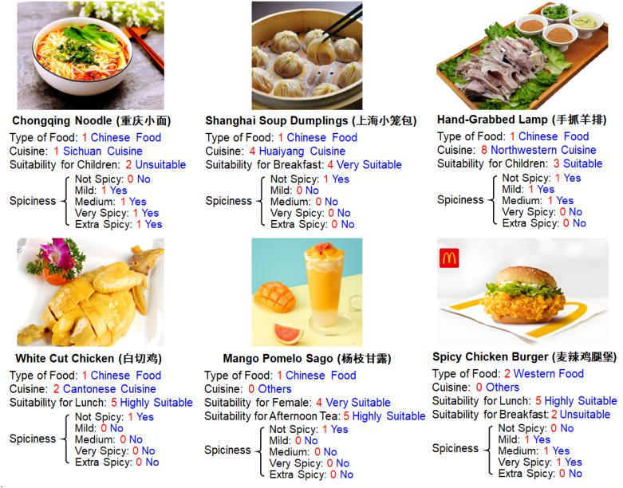

# CRFD-25
CRFD-25 is a newly constructed dataset to advance food and drink recommendation services for railway travelers. It contains representative dishes collected from 33 high railway traffic cities. In each city, more than 200 signature dishes are manually picked and labeled from different restaurants. The data is sourced from [Meituan](https://www.waimai.meituan.com) and [Dianping](https://www.dianping.com), two of the leading online food delivery platforms in China.

# 🔍 Introduction
We show "food and drink.csv" and "restaurant.csv" of three main cities in China including Beijing,Shanghai and Guangzhou.For the "food and drink.csv", we define 16 types of labels.For the intrinsic attribute, there are 8 attributes like city_id,restaurant_id,price and so on. To precisely recommend to different groups of people, we incorporates spiciness levels (not-spicy to extra-spicy), age groups (child/tee-nager/adult/middle-ager/elderly), meal periods (breakfast/lunch/dinner/afternoon-tea/night-snack), genders (male/female),seasons (spring /summer/autumn/winter), plus food_score for ratings and image_name for visual references,enabling to support analyzing dining habits, tastes, and regional preferences, ultimately facilitating the delivery of accurate and personalized food recommendations.Labels of the "restaurant.csv" are almost the same as the "food and drink.csv".The difference lies in some intrinsic attributes of restaurants like restaurant_id, average_score, restaurant_type and so on.CRFD-25 dataset is introduced in our paper which presents [LLM4Rail](https://anonymous.4open.science/r/LLM4Rail), an LLM-based railway service consulting platform.

# 📋 Acquire The Complete Dataset 
If you want to acquire the complete dataset, please send an email to xxxxx
